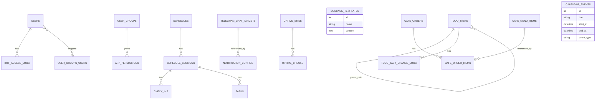

# LoopStudioTeleBot

Monorepo cho hệ sinh thái Loop Studio gồm:
- `LoopStudioWeb` (Flask Web App)
- `LoopStudioBot` (Telegram Bot)

## 1) Project Workflow

### User Flow (Business)
1. Người dùng đăng nhập `LoopStudioWeb`.
2. Quản lý dữ liệu theo module: Schedule, Todo, Calendar, Cafe POS, Uptime.
3. Scheduler nền của Web xử lý nhắc việc/nhắc lịch/uptime checks.
4. `LoopStudioBot` gọi API nội bộ của Web (`/api/bot/*`) để lấy dữ liệu và phản hồi lệnh (`/todo`, `/uptime`, `/otp`...).
5. Web gửi Telegram chủ động qua Telegram HTTP API theo cấu hình `Bot Admin`.

### Development Flow
1. Sửa code trong `LoopStudioWeb/src` hoặc `LoopStudioBot/src`.
2. Chạy/khởi động lại service web/bot.
3. Kiểm tra UI + endpoint + bot command.
4. Kiểm tra lint/syntax.
5. Commit thay đổi.

### Deployment Flow (Docker)
1. Cập nhật `.env` cho Web/Bot.
2. Build image và chạy bằng `docker-compose`.
3. Verify:
   - Web routes hoạt động
   - Bot polling ổn định
   - Scheduler jobs chạy đúng

## 2) Code Architecture

## LoopStudioWeb
- `src/app.py`: app factory, blueprint registration, schema ensure logic, RBAC middleware.
- `src/models/`: SQLAlchemy models theo domain.
- `src/routes/`: web endpoints + API endpoints.
- `src/services/`: business logic (calendar aggregation, todo messages, telegram send, uptime check...).
- `src/templates/`: Jinja UI.

### Architectural Pattern
- Flask MVC-ish:
  - Route = controller entry
  - Model = persistence
  - Service = domain logic/reusable logic
  - Template = view

## LoopStudioBot
- `src/main.py`: bootstrap Telegram Application + polling.
- `src/handlers/commands.py`: lệnh bot.
- `src/utils/`: logger, bot log utility, scheduler.
- `src/services/`: local services (ví dụ netstat).

### Bot Integration Pattern
- Bot đóng vai trò command interface.
- Dữ liệu nghiệp vụ nằm ở Web App, bot gọi lại `LoopStudioWeb /api/bot/*`.

## 3) Database Schema (High-level)

## 4) Todo + Gantt Design

- `TodoTask` tự tham chiếu (`parent_task_id`) để tạo subtask.
- `TodoTaskChangeLog` lưu lịch sử thay đổi đầy đủ.
- Gantt hỗ trợ:
  - week / month / year / custom range
  - parent/subtask links
  - collapse/expand theo task cha
  - scroll sync header/body

## 5) API Docs

- Trang API docs nội bộ tại:
  - `GET /api-docs`
- Tập trung mô tả API giao tiếp giữa Bot và Web + endpoints quan trọng.

## 6) Notes

- Hệ thống dùng cơ chế schema ensure trong `app.py` để tương thích DB cũ (không bắt buộc Alembic).
- Telegram gửi lỗi chi tiết qua `send_telegram_message_verbose` để dễ debug.
- Khi triển khai production, cần giới hạn quyền truy cập route admin và bảo vệ `.env`.
